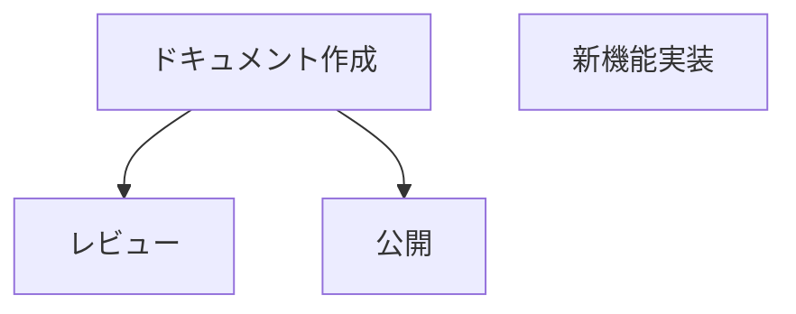

# Zeus API リファレンス

## 1. 概要

### 1.1 コマンド体系

Zeus CLI は以下のコマンド体系を持ちます:

```
zeus <command> [subcommand] [arguments] [options]
```

### 1.2 グローバルフラグ

| フラグ | 短縮形 | 説明 |
|--------|-------|------|
| `--verbose` | `-v` | 詳細出力を有効化 |
| `--format` | `-f` | 出力形式を指定（text\|json） |
| `--help` | `-h` | ヘルプを表示 |

### 1.3 出力形式

デフォルトの出力形式はテキスト（人間可読）です。`--format=json` を指定すると JSON 形式で出力されます（スクリプト連携用）。

## 2. コマンドリファレンス

### 2.1 プロジェクト管理

#### init

**構文**
```bash
zeus init
```

**説明**
プロジェクトディレクトリに `.zeus/` フォルダを作成し、Zeus プロジェクトを初期化します。
同時に `.claude/` ディレクトリも作成され、Claude Code 連携用のエージェント・スキルファイルが生成されます。

デフォルトの `automation_level` は `auto`（即時実行、承認不要）に設定されます。
承認フローが必要な場合は、初期化後に `zeus.yaml` の `automation_level` を `notify` または `approve` に変更してください。

**使用例**
```bash
# プロジェクトを初期化
zeus init
```

**出力例**
```
✓ Zeus initialized successfully!
  Path:  .zeus
```

**終了ステータス**
- 0: 成功
- 1: 既に初期化済み、またはエラー

---

#### status

**構文**
```bash
zeus status
```

**説明**
プロジェクトの現在の状態を表示します。

**使用例**
```bash
zeus status
```

**出力例**
```
Zeus Project Status
═══════════════════════════════════════════════════════════
Project: My Project
Health:  good

Activities Summary:
  Total:       10
  Completed:   5
  In Progress: 3
  Pending:     2

Pending Approvals: 1
═══════════════════════════════════════════════════════════
```

**終了ステータス**
- 0: 成功
- 1: プロジェクト未初期化、またはエラー

---

### 2.2 エンティティ管理

#### add

**構文**
```bash
zeus add <entity> <name>
```

**説明**
新しいエンティティ（Activity 等）を追加します。

**引数**
| 引数 | 必須 | 説明 |
|-----|------|-----|
| `entity` | はい | エンティティタイプ（例: activity） |
| `name` | はい | エンティティ名 |

**使用例**
```bash
# Activity を追加
zeus add activity "新機能の実装"
```

**出力例**
```
✓ Added activity: 新機能の実装 (ID: act-abc123)
```

承認が必要な場合（`automation_level: approve` の場合）:
```
⏳ activity '新機能の実装' は承認待ちキューに追加されました
   承認ID: appr-xyz789
   'zeus pending' で確認、'zeus approve <id>' で承認できます
```

**終了ステータス**
- 0: 成功（追加完了または承認待ちキューに追加）
- 1: エラー

---

#### list

**構文**
```bash
zeus list [entity] [options]
```

**説明**
エンティティの一覧を表示します。

**引数**
| 引数 | 必須 | 説明 |
|-----|------|-----|
| `entity` | いいえ | エンティティタイプ（省略時は全て） |

**オプション**
| オプション | 短縮形 | デフォルト | 説明 |
|-----------|-------|----------|------|
| `--status` | `-s` | - | ステータスでフィルタ |

**使用例**
```bash
# 全エンティティを表示
zeus list

# Activity のみ表示
zeus list activities

# 進行中の Activity のみ
zeus list activities --status=in_progress
```

**出力例**
```
Activities (3 items)
────────────────────────────────────────
[pending] act-001 - ドキュメント作成
[in_progress] act-002 - 新機能の実装
[completed] act-003 - バグ修正
```

**終了ステータス**
- 0: 成功
- 1: エラー

---

### 2.3 承認管理

#### pending

**構文**
```bash
zeus pending
```

**説明**
承認待ちアイテムの一覧を表示します。

**使用例**
```bash
zeus pending
```

**出力例**
```
Pending Approvals
═══════════════════════════════════════════════════════════
[approve] appr-001 - タスク追加: 新機能の実装
    Type: add_task | Created: 2026-01-15T10:00:00Z
═══════════════════════════════════════════════════════════
Total: 1 item(s)

Use 'zeus approve <id>' to approve or 'zeus reject <id>' to reject.
```

**終了ステータス**
- 0: 成功
- 1: エラー

---

#### approve

**構文**
```bash
zeus approve <id>
```

**説明**
指定された ID のアイテムを承認します。

**引数**
| 引数 | 必須 | 説明 |
|-----|------|-----|
| `id` | はい | 承認待ちアイテムの ID |

**使用例**
```bash
zeus approve appr-001
```

**出力例**
```
✓ Approved: appr-001
```

**終了ステータス**
- 0: 成功
- 1: ID が見つからない、またはエラー

---

#### reject

**構文**
```bash
zeus reject <id> [options]
```

**説明**
指定された ID のアイテムを却下します。

**引数**
| 引数 | 必須 | 説明 |
|-----|------|-----|
| `id` | はい | 承認待ちアイテムの ID |

**オプション**
| オプション | 短縮形 | デフォルト | 説明 |
|-----------|-------|----------|------|
| `--reason` | `-r` | - | 却下理由 |

**使用例**
```bash
# 理由なしで却下
zeus reject appr-001

# 理由付きで却下
zeus reject appr-001 --reason "優先度が低いため"
```

**出力例**
```
✗ Rejected: appr-001
  Reason: 優先度が低いため
```

**終了ステータス**
- 0: 成功
- 1: ID が見つからない、またはエラー

---

### 2.4 スナップショット管理

#### snapshot create

**構文**
```bash
zeus snapshot create [label]
```

**説明**
プロジェクト状態のスナップショットを作成します。

**引数**
| 引数 | 必須 | 説明 |
|-----|------|-----|
| `label` | いいえ | スナップショットのラベル |

**使用例**
```bash
# ラベルなしで作成
zeus snapshot create

# ラベル付きで作成
zeus snapshot create "リリース前"
```

**出力例**
```
✓ Snapshot created: 2026-01-15T10:00:00Z
  Label: リリース前
```

**終了ステータス**
- 0: 成功
- 1: エラー

---

#### snapshot list

**構文**
```bash
zeus snapshot list [options]
```

**説明**
スナップショットの一覧を表示します。

**オプション**
| オプション | 短縮形 | デフォルト | 説明 |
|-----------|-------|----------|------|
| `--limit` | `-n` | `10` | 表示件数 |

**使用例**
```bash
# デフォルト（10件）
zeus snapshot list

# 5件のみ表示
zeus snapshot list -n 5
```

**出力例**
```
Snapshots
═══════════════════════════════════════════════════════════
  2026-01-15T10:00:00Z (リリース前)
    Health: good | Tasks: 10 | Completed: 8
  2026-01-14T18:00:00Z
    Health: fair | Tasks: 10 | Completed: 5
═══════════════════════════════════════════════════════════
Total: 2 snapshot(s)
```

**終了ステータス**
- 0: 成功
- 1: エラー

---

#### snapshot restore

**構文**
```bash
zeus snapshot restore <timestamp>
```

**説明**
指定されたスナップショットからプロジェクト状態を復元します。

**引数**
| 引数 | 必須 | 説明 |
|-----|------|-----|
| `timestamp` | はい | スナップショットのタイムスタンプ |

**使用例**
```bash
zeus snapshot restore 2026-01-15T10:00:00Z
```

**出力例**
```
✓ Restored from snapshot: 2026-01-15T10:00:00Z
```

**終了ステータス**
- 0: 成功
- 1: スナップショットが見つからない、またはエラー

---

### 2.5 履歴管理

#### history

**構文**
```bash
zeus history [options]
```

**説明**
プロジェクト状態の履歴を表示します。

**オプション**
| オプション | 短縮形 | デフォルト | 説明 |
|-----------|-------|----------|------|
| `--limit` | `-n` | `10` | 表示件数 |

**使用例**
```bash
# デフォルト（10件）
zeus history

# 5件のみ表示
zeus history -n 5
```

**出力例**
```
Project History
═══════════════════════════════════════════════════════════
1. 2026-01-15T10:00:00Z [リリース前]
   Health: good | Tasks: 10 (Completed: 8, In Progress: 1, Pending: 1)

2. 2026-01-14T18:00:00Z
   Health: fair | Tasks: 10 (Completed: 5, In Progress: 3, Pending: 2)
═══════════════════════════════════════════════════════════
Use 'zeus snapshot restore <timestamp>' to restore a snapshot.
```

**終了ステータス**
- 0: 成功
- 1: エラー

---

### 2.6 診断・修復

#### doctor

**構文**
```bash
zeus doctor
```

**説明**
システムの健全性を診断し、問題を検出します。

**使用例**
```bash
zeus doctor
```

**出力例**
```
Zeus Doctor - System Diagnosis
═══════════════════════════════════════════════════════════
✓ zeus_yaml: zeus.yaml exists and is valid
✓ tasks_dir: tasks directory exists
⚠ backup_health: No recent backups found
✗ yaml_syntax: 1 YAML syntax error found
═══════════════════════════════════════════════════════════
Overall: fair

2 issue(s) can be fixed automatically. Run 'zeus fix' to repair.
```

**診断項目**
| 項目 | 説明 |
|------|------|
| zeus_yaml | zeus.yaml の存在と妥当性 |
| tasks_dir | タスクディレクトリの存在 |
| state_dir | 状態ディレクトリの存在 |
| backup_health | バックアップの状態 |
| yaml_syntax | YAML ファイルの構文 |
| state_integrity | 状態の整合性 |

**終了ステータス**
- 0: 全て正常
- 1: 警告または問題あり

---

#### fix

**構文**
```bash
zeus fix [options]
```

**説明**
検出された問題を自動修復します。

**オプション**
| オプション | 短縮形 | デフォルト | 説明 |
|-----------|-------|----------|------|
| `--dry-run` | - | `false` | 実際に修復せず、何が行われるかを表示 |

**使用例**
```bash
# プレビュー
zeus fix --dry-run

# 実行
zeus fix
```

**出力例（dry-run）**
```
DRY RUN - No changes will be made
○ Create missing backups directory (would be executed)
○ Fix YAML syntax in tasks/active.yaml (would be executed)
```

**出力例（実行）**
```
✓ Create missing backups directory
✓ Fix YAML syntax in tasks/active.yaml
```

**終了ステータス**
- 0: 成功
- 1: 修復失敗

---

### 2.7 AI機能

#### suggest

**構文**
```bash
zeus suggest [options]
```

**説明**
現在のプロジェクト状態を分析し、AI がタスク提案を生成します。

**オプション**
| オプション | 短縮形 | デフォルト | 説明 |
|-----------|-------|----------|------|
| `--limit` | - | `5` | 生成する提案の最大数 |
| `--impact` | - | - | 影響度でフィルタ（high\|medium\|low） |
| `--force` | - | `false` | 既存の提案を上書き |

**使用例**
```bash
# デフォルト（最大5件）
zeus suggest

# 3件のみ生成
zeus suggest --limit 3

# 高影響のみ
zeus suggest --impact high
```

**出力例**
```
[SUGGESTIONS] 2件の提案が生成されました:

1. [high] テストタスクの追加を推奨
   理由: テストカバレッジが不足しています
   ID: sug-001
   見積: 4.0時間

2. [medium] 優先度の見直しを推奨
   理由: ブロックされているタスクがあります
   ID: sug-002

[HINT] 提案を適用するには: zeus apply <suggestion-id>
[HINT] すべて適用するには: zeus apply --all
```

**終了ステータス**
- 0: 成功
- 1: エラー

---

#### apply

**構文**
```bash
zeus apply [suggestion-id] [options]
```

**説明**
`zeus suggest` で生成された提案を適用します。

**引数**
| 引数 | 必須 | 説明 |
|-----|------|-----|
| `suggestion-id` | 条件付き | 提案 ID（`--all` 指定時は不要） |

**オプション**
| オプション | 短縮形 | デフォルト | 説明 |
|-----------|-------|----------|------|
| `--all` | - | `false` | すべての保留中の提案を適用 |
| `--dry-run` | - | `false` | 実際には適用せずに表示のみ |

**使用例**
```bash
# 個別適用
zeus apply sug-001

# 全て適用
zeus apply --all

# プレビュー
zeus apply --all --dry-run
```

**出力例**
```
[OK] 提案 sug-001 を適用しました
   新規 Activity ID: act-xyz789
```

**終了ステータス**
- 0: 成功
- 1: 提案が見つからない、またはエラー

---

#### explain

**構文**
```bash
zeus explain <entity-id> [options]
```

**説明**
指定されたエンティティの詳細説明を生成します。

**引数**
| 引数 | 必須 | 説明 |
|-----|------|-----|
| `entity-id` | はい | エンティティ ID（"project" で全体説明） |

**オプション**
| オプション | 短縮形 | デフォルト | 説明 |
|-----------|-------|----------|------|
| `--context` | - | `false` | コンテキスト情報を含める |

**使用例**
```bash
# プロジェクト全体の説明
zeus explain project

# 特定 Activity の説明
zeus explain act-001

# コンテキスト情報を含む
zeus explain act-001 --context
```

**出力例**
```
Zeus Explain
═══════════════════════════════════════════════════════════
Entity: act-001
Type:   activity

Summary:
  このタスクはドキュメント作成に関するものです。

Details:
  優先度は高く、完了目標は今週末です。

Suggestions:
  - 作業を細分化することを検討してください
═══════════════════════════════════════════════════════════
```

**終了ステータス**
- 0: 成功
- 1: エンティティが見つからない、またはエラー

---

#### graph

**構文**
```bash
zeus graph [options]
```

**説明**
タスク依存関係のグラフを生成します。

**オプション**
| オプション | 短縮形 | デフォルト | 説明 |
|-----------|-------|----------|------|
| `--format` | `-f` | `text` | 出力形式（text\|dot\|mermaid） |
| `--output` | `-o` | - | 出力ファイル（省略時は標準出力） |

**使用例**
```bash
# テキスト形式で表示
zeus graph

# DOT 形式でファイル出力
zeus graph --format=dot --output=deps.dot

# Mermaid 形式
zeus graph -f mermaid -o deps.md
```

**出力例（text）**
```
Zeus Dependency Graph
============================================================
act-001: ドキュメント作成
├── act-002: レビュー
└── act-003: 公開

act-004: 新機能実装 (独立)
============================================================
```

**出力例（mermaid）**


**終了ステータス**
- 0: 成功
- 1: エラー

---

#### predict

**構文**
```bash
zeus predict [type]
```

**説明**
プロジェクトの予測分析を表示します。

**引数**
| 引数 | 必須 | 説明 |
|-----|------|-----|
| `type` | いいえ | 予測タイプ（completion\|risk\|velocity\|all） |

**使用例**
```bash
# 全ての予測
zeus predict

# 完了日予測のみ
zeus predict completion

# リスク予測のみ
zeus predict risk

# ベロシティ分析のみ
zeus predict velocity
```

**出力例**
```
Zeus Prediction Analysis
============================================================

[COMPLETION PREDICTION]
  Estimated Completion: 2026-02-15
  Margin:               +/- 5 days
  Average Velocity:     3.5 tasks/week
  Remaining Tasks:      12
  Confidence:           75%

[RISK PREDICTION]
  Overall Risk Level:   Medium
  Risk Score:           45/100

  Risk Factors:
    - 依存関係の複雑さ (Impact: 6/10)
      複数のタスクが相互依存しています

[VELOCITY ANALYSIS]
  Last 7 days:          4 tasks completed
  Last 14 days:         7 tasks completed
  Last 30 days:         15 tasks completed
  Weekly Average:       3.5 tasks
  Trend:                Stable

============================================================
```

**終了ステータス**
- 0: 成功
- 1: エラー

---

#### report

**構文**
```bash
zeus report [options]
```

**説明**
プロジェクトの包括的なレポートを生成します。

**オプション**
| オプション | 短縮形 | デフォルト | 説明 |
|-----------|-------|----------|------|
| `--format` | `-f` | `text` | 出力形式（text\|html\|markdown） |
| `--output` | `-o` | - | 出力ファイル（省略時は標準出力） |

**使用例**
```bash
# テキスト形式で表示
zeus report

# HTML 形式でファイル出力
zeus report --format=html --output=report.html

# Markdown 形式
zeus report -f markdown -o report.md
```

**終了ステータス**
- 0: 成功
- 1: エラー

---

### 2.8 可視化・ダッシュボード（Phase 5）

#### dashboard

**構文**
```bash
zeus dashboard [options]
```

**説明**
ブラウザでプロジェクト状態をリアルタイム可視化する Web ダッシュボードを起動します。

ダッシュボードには以下の情報が表示されます:
- プロジェクト概要と進捗率
- タスク統計と一覧
- 依存関係グラフ（Mermaid.js）
- 予測分析（完了日、リスク、ベロシティ）

**オプション**
| オプション | 短縮形 | デフォルト | 説明 |
|-----------|-------|----------|------|
| `--port` | `-p` | `8080` | サーバーのポート番号 |
| `--no-open` | - | `false` | ブラウザを自動で開かない |

**使用例**
```bash
# デフォルト設定で起動（ポート8080、ブラウザ自動起動）
zeus dashboard

# カスタムポートで起動
zeus dashboard --port 3000

# ブラウザを自動で開かない
zeus dashboard --no-open

# ポート指定 + ブラウザ自動起動なし
zeus dashboard -p 9000 --no-open
```

**出力例**
```
Zeus Dashboard
═══════════════════════════════════════════════════════════
Starting server on port 8080...

Dashboard: http://localhost:8080

Press Ctrl+C to stop the server
═══════════════════════════════════════════════════════════
```

**ダッシュボード機能**

| 機能 | 説明 |
|------|------|
| プロジェクト概要 | プロジェクト名、健全性、進捗率を表示 |
| タスク統計 | 完了/進行中/未着手/ブロック中のタスク数を集計 |
| タスク一覧 | 全タスクをステータス別にテーブル表示 |
| 依存関係グラフ | Mermaid.js を使用した依存関係の可視化 |
| 予測分析 | 完了日予測、リスク予測、ベロシティ分析を表示 |

**サーバー制御**

- サーバーは `Ctrl+C` で停止できます
- グレースフルシャットダウンに対応しています
- 複数のダッシュボードを異なるポートで同時に起動できます

**プラットフォーム対応**

| OS | ブラウザ起動コマンド |
|----|---------------------|
| macOS | `open` |
| Linux | `xdg-open` |
| Windows | `rundll32 url.dll,FileProtocolHandler` |

**終了ステータス**
- 0: 成功（正常終了）
- 1: サーバー起動失敗、またはエラー

**注意事項**
- ポートが既に使用中の場合、起動に失敗します。別のポートを指定してください。
- ブラウザの自動起動に失敗しても、サーバーは正常に起動します。

---

### 2.9 WBS・タイムライン（Phase 6）

Phase 6 で追加された WBS 階層とタイムライン機能です。

#### ダッシュボード API エンドポイント

| エンドポイント | メソッド | 説明 |
|---------------|---------|------|
| `/api/wbs` | GET | WBS 階層データを取得 |
| `/api/timeline` | GET | タイムラインデータを取得 |
| `/api/downstream/<id>` | GET | 指定 Activity の影響範囲（downstream 依存）を取得 |

**使用例**
```bash
# WBS 階層データを取得
curl http://localhost:8080/api/wbs | jq

# タイムラインデータを取得
curl http://localhost:8080/api/timeline | jq

# 特定 Activity の影響範囲を取得
curl http://localhost:8080/api/downstream/act-001 | jq
```

**WBS レスポンス例**
```json
{
  "nodes": [
    {
      "id": "act-001",
      "title": "親 Activity",
      "wbs_code": "1",
      "children": ["act-002", "act-003"]
    }
  ]
}
```

**タイムライン レスポンス例**
```json
{
  "items": [
    {
      "id": "act-001",
      "title": "Activity 名",
      "start_date": "2026-01-15",
      "due_date": "2026-01-31",
      "progress": 50,
      "is_critical": true
    }
  ]
}
```

---

## 3. データ型

### 3.1 ActivityStatus

Activity のステータスを表します。

| 値 | 説明 |
|----|------|
| `pending` | 未着手 |
| `in_progress` | 進行中 |
| `completed` | 完了 |
| `blocked` | ブロック中 |

### 3.2 ApprovalLevel

承認レベルを表します。

| 値 | 説明 |
|----|------|
| `auto` | 自動承認（即時実行） |
| `notify` | 通知付き実行 |
| `approve` | 事前承認必須 |

### 3.3 ActivityPriority

Activity の優先度を表します。

| 値 | 説明 |
|----|------|
| `high` | 高優先度 |
| `medium` | 中優先度 |
| `low` | 低優先度 |

### 3.4 HealthStatus

プロジェクトの健全性を表します。

| 値 | 説明 |
|----|------|
| `good` | 良好 |
| `fair` | 普通（警告あり） |
| `poor` | 不良（問題あり） |
| `unknown` | 不明 |

### 3.5 SuggestionType

提案のタイプを表します。

| 値 | 説明 |
|----|------|
| `new_activity` | 新規 Activity の追加 |
| `priority_change` | 優先度の変更 |
| `dependency` | 依存関係の追加 |
| `risk_mitigation` | リスク対策 |

### 3.6 SuggestionImpact

提案の影響度を表します。

| 値 | 説明 |
|----|------|
| `high` | 高影響 |
| `medium` | 中影響 |
| `low` | 低影響 |

---

## 4. ファイル形式

### 4.1 zeus.yaml

プロジェクトのメイン設定ファイルです。

```yaml
version: "1.0"
project:
  id: "zeus-1234567890"
  name: "プロジェクト名"
  description: "プロジェクトの説明"
  start_date: "2026-01-15"
objectives:
  - id: "obj-001"
    title: "目標タイトル"
    deadline: "2026-03-31"
    priority: "high"
settings:
  automation_level: "auto"        # auto|notify|approve（デフォルト: auto）
  approval_mode: "default"        # default|strict|loose
  ai_provider: "claude-code"
```

### 4.2 Activity

Activity の構造です（Simple モード）。

```yaml
id: "act-001"
title: "Activity タイトル"
description: "Activity の説明"
status: "pending"              # pending|in_progress|completed|blocked
priority: "medium"             # high|medium|low
assignee: "user"
estimate_hours: 8.0
actual_hours: 0.0
dependencies:
  - "act-000"
approval_level: "auto"         # auto|notify|approve
created_at: "2026-01-15T10:00:00Z"
updated_at: "2026-01-15T10:00:00Z"
```

### 4.3 ProjectState

プロジェクト状態の構造です。

```yaml
timestamp: "2026-01-15T10:00:00Z"
summary:
  total_activities: 10
  completed: 5
  in_progress: 3
  pending: 2
health: "good"                 # good|fair|poor|unknown
risks:
  - "締め切りまで時間が少ない"
```

### 4.4 Suggestion

提案の構造です。

```yaml
id: "sug-001"
type: "new_activity"           # new_activity|priority_change|dependency|risk_mitigation
description: "提案の説明"
rationale: "提案の理由"
impact: "high"                 # high|medium|low
status: "pending"              # pending|applied|rejected
created_at: "2026-01-15T10:00:00Z"
# new_activity の場合
activity_data:
  title: "新規 Activity"
  estimate_hours: 4.0
# priority_change の場合
target_activity_id: "act-001"
new_priority: "high"
# dependency の場合
target_activity_id: "act-001"
dependencies:
  - "act-002"
```

---

## 5. エラーコード

### 5.1 一般的なエラー

| エラー | 説明 | 対処方法 |
|--------|------|---------|
| `project not initialized` | プロジェクトが初期化されていない | `zeus init` を実行 |
| `entity not found` | 指定されたエンティティが存在しない | ID を確認して再実行 |
| `invalid YAML syntax` | YAML ファイルの構文エラー | `zeus doctor` で診断、`zeus fix` で修復 |
| `permission denied` | ファイルアクセス権限がない | ファイル権限を確認 |

### 5.2 承認関連エラー

| エラー | 説明 | 対処方法 |
|--------|------|---------|
| `approval not found` | 承認待ちアイテムが存在しない | `zeus pending` で ID を確認 |
| `already processed` | 既に処理済み | 新しい承認待ちを確認 |

### 5.3 提案関連エラー

| エラー | 説明 | 対処方法 |
|--------|------|---------|
| `suggestion not found` | 提案が存在しない | `zeus suggest` で再生成 |
| `suggestion already applied` | 提案が既に適用済み | 別の提案を指定 |

### 5.4 ダッシュボード関連エラー

| エラー | 説明 | 対処方法 |
|--------|------|---------|
| `port already in use` | ポートが既に使用中 | `--port` で別のポートを指定 |
| `server startup failed` | サーバー起動に失敗 | エラーメッセージを確認 |
| `browser open failed` | ブラウザを開けない | 手動で URL にアクセス |

---

*Zeus API Reference v1.2*
*作成日: 2026-01-15*
*更新日: 2026-01-17（Phase 6 エンドポイント追加）*
