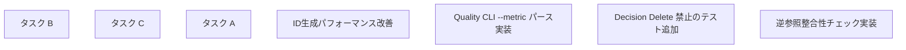

```mermaid
graph TD
    task_3d8bf6c2["タスク B"]
    task_69dbce5a["タスク C"]
    task_805a1ed4["タスク A"]
    task_bc5159d1["ID生成パフォーマンス改善"]
    task_c1f271cf["Quality CLI --metric パース実装"]
    task_cb53b508["Decision Delete 禁止のテスト追加"]
    task_f657a5e0["逆参照整合性チェック実装"]


```
