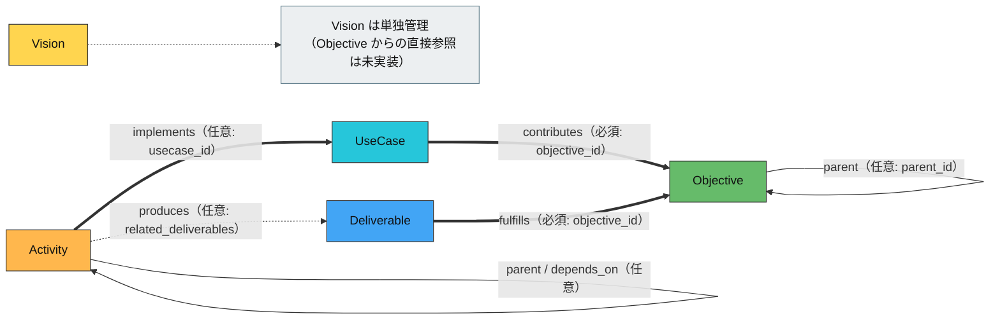

# Zeus システム設計書

> 正本判定: `docs/README.md` を参照。CLI は `cmd/*.go`、HTTP API は `internal/dashboard/server.go` を正本とする。

## 1. 設計目的

Zeus は、プロジェクト構造を CLI と Web ダッシュボードで一貫管理するローカル実行型システムである。本書は現行実装に基づく構成・責務・公開インターフェースを定義する。

## 2. システム構成

## 2.1 レイヤー

| レイヤー | 主要実装 | 役割 |
|---|---|---|
| CLI | `cmd/*.go` | ユーザー操作の入口、ユースケース実行 |
| Core | `internal/core/*` | エンティティ操作、整合性検証、状態管理 |
| Analysis | `internal/analysis/*` | 依存グラフ、統合グラフ、Affinity 計算 |
| Dashboard API | `internal/dashboard/*` | REST API / SSE 提供 |
| Storage | `.zeus/` 配下 YAML | 永続化（DB 非依存） |

## 2.2 実行モデル

- CLI: 単発コマンド実行（同期処理）
- Dashboard: `127.0.0.1:<port>` で HTTP サーバー起動
- SSE: `/api/events` で状態更新を push 配信

## 3. ドメインモデル

## 3.1 主要エンティティ

| 区分 | エンティティ |
|---|---|
| 戦略 | Vision, Objective, Deliverable |
| 意思決定 | Consideration, Decision |
| リスク管理 | Problem, Risk, Assumption |
| 制約・品質 | Constraint, Quality |
| UML | Actor, UseCase, Subsystem |
| 実行単位 | Activity |

## 3.2 Activity の位置づけ

- Task は Activity に統合済み。
- Activity は `Simple`（作業追跡）と `Flow`（ノード/遷移を持つ図表現）を同一モデルで扱う。
- Unified Graph は Activity, UseCase, Deliverable, Objective を横断結合して可視化する。

## 3.3 5要素関係（実装準拠）

以下は `vision / objective / deliverable / usecase / activity` の関係を、現行実装（`HEAD`）に合わせて図示したもの。

| From | To | 関係 | 必須性 | 根拠フィールド |
|---|---|---|---|---|
| Deliverable | Objective | fulfills | 必須 | `objective_id` |
| UseCase | Objective | contributes | 必須 | `objective_id` |
| Activity | UseCase | implements | 任意 | `usecase_id` |
| Activity | Deliverable | produces | 任意（推奨） | `related_deliverables` |
| Objective | Objective | parent | 任意 | `parent_id` |
| Activity | Activity | parent / depends_on | 任意 | `parent_id` / `dependencies` |
| Vision | (他5要素) | 直接参照 | 未実装 | 単一 `vision.yaml` 管理 |

実装根拠:
- `internal/core/types.go`
- `internal/analysis/unified_graph.go`

## 4. CLI 設計

## 4.1 公開コマンド群

| カテゴリ | コマンド |
|---|---|
| コア | `init`, `status`, `add`, `list`, `doctor`, `fix` |
| 承認/履歴 | `pending`, `approve`, `reject`, `snapshot`, `history` |
| AI支援 | `suggest`, `apply`, `explain`, `update-claude` |
| 分析/可視化 | `graph`, `report`, `dashboard` |
| UML | `uml show usecase`, `usecase add-actor`, `usecase link` |

## 4.2 重要フラグ

| コマンド | フラグ | 意味 |
|---|---|---|
| `graph` | `--unified` | 統合グラフモード |
| `graph --unified` | `--focus`, `--depth` | 中心ノードと深さ |
| `graph --unified` | `--types` | `activity,usecase,deliverable,objective` |
| `graph --unified` | `--layers` | `structural,reference` |
| `graph --unified` | `--relations` | `parent,depends_on,implements,contributes,fulfills,produces` |
| `dashboard` | `--port`, `--no-open`, `--dev` | ポート/自動起動/開発モード |
| `report` | `--format`, `--output` | 出力形式/保存先 |

## 5. HTTP API 設計

`internal/dashboard/server.go` の `mux.HandleFunc` が公開契約。

| Method | Path | 役割 |
|---|---|---|
| GET | `/api/status` | プロジェクト状態 |
| GET | `/api/graph` | 依存グラフ（Mermaid + 統計） |
| GET | `/api/affinity` | Affinity 計算結果 |
| GET | `/api/actors` | Actor 一覧 |
| GET | `/api/usecases` | UseCase 一覧 |
| GET | `/api/subsystems` | Subsystem 一覧 |
| GET | `/api/uml/usecase` | UseCase 図（Mermaid） |
| GET | `/api/activities` | Activity 一覧 |
| GET | `/api/uml/activity` | Activity 図（Mermaid） |
| GET | `/api/unified-graph` | 統合グラフ |
| GET | `/api/events` | SSE ストリーム |

## 5.1 API クエリ契約

| Path | クエリ | 説明 |
|---|---|---|
| `/api/affinity` | `max_siblings`, `min_score`, `max_edges` | Affinity 抽出条件 |
| `/api/uml/usecase` | `boundary` | 境界名 |
| `/api/uml/activity` | `id`(必須) | 対象 Activity |
| `/api/unified-graph` | `focus`, `depth`, `types`, `layers`, `relations`, `hide-completed`, `hide-draft` | 統合グラフフィルタ |

## 6. データフロー

## 6.1 CLI -> Core -> YAML

1. `cmd` が入力を受け取る。
2. `core.Zeus` がユースケース処理を実行する。
3. `.zeus/` 配下の YAML を更新または参照する。

## 6.2 Dashboard API -> Core/Analysis -> JSON

1. `handleAPI*` がリクエストを受理。
2. Core/Analysis でモデルを構築。
3. レスポンス型へ変換して JSON 返却。

## 6.3 SSE 配信

1. クライアントが `/api/events` に接続。
2. `SSEBroadcaster` がクライアントを管理。
3. `status` / `graph` / `approval` イベントを配信。

## 7. フェーズ定義（矛盾防止）

## 7.1 機能フェーズ

| フェーズ | 状態 | 根拠 |
|---|---|---|
| Phase 1: 基本CLI | 完了 | `cmd/init.go` ほか |
| Phase 2: 承認/履歴 | 完了 | `cmd/pending.go`, `cmd/snapshot.go` |
| Phase 3: AI支援 | 完了 | `cmd/suggest.go`, `cmd/apply.go`, `cmd/explain.go` |
| Phase 4: 分析 | 完了 | `cmd/graph.go`, `cmd/report.go` |
| Phase 5: ダッシュボード | 完了 | `cmd/dashboard.go`, `internal/dashboard/server.go` |
| Phase 7: Affinity | 完了 | `internal/dashboard/handlers_affinity.go` |

## 7.2 外部連携フェーズ

| 項目 | 状態 | 備考 |
|---|---|---|
| Git自動連携 | 未実装 | リポジトリ操作は手動 |
| Slack/Email 通知 | 未実装 | SSE/CLI による確認 |
| 認証・認可 | 未実装 | ローカルバインド運用を前提 |

## 8. 非機能要件

| 項目 | 現行設計 |
|---|---|
| セキュリティ | HTTP は `127.0.0.1` にバインド |
| 可用性 | ファイルベースのため単体復旧が容易 |
| 可観測性 | `doctor`, `status`, `history`, API統計 |
| 可搬性 | Go 単体バイナリ + YAML |

## 9. 変更管理

- 公開 CLI 追加/変更時: `cmd/*.go` 変更後に `docs/api-reference.md` を更新。
- 公開 API 追加/変更時: `internal/dashboard/server.go` と各 handler 変更後に `docs/api-reference.md` を更新。
- 正本/履歴分類変更時: `docs/README.md` を更新。

## 10. 関連文書

- 正本入口: `docs/README.md`
- 運用手順: `docs/operations-manual.md`
- API 契約: `docs/api-reference.md`
- 利用手順: `docs/user-guide.md`
- 開発要約: `CLAUDE.md`

*更新日: 2026-02-07（文書同期版）*
